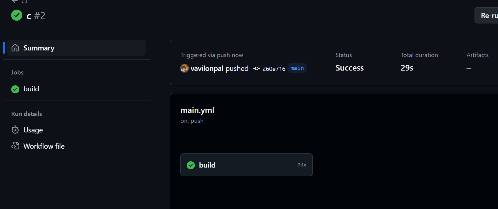

### Лабараторная работа №8
***
Тема: Непрерывная интеграция с помощью Github Actions
Выполнил: Алексеев Сергей
Дата: 09.04.25
***
### Цель работы
В рамках данной работы студенты научатся настраивать непрерывную интеграцию с помощью Github Actions.
***
### Задание
Создать Web приложение, написать тесты для него и настроить непрерывную интеграцию с помощью Github Actions на базе контейнеров.
***
### Ход работы

1) Создаем директорию site со следующей структурой:
    - 

2) Создаем файл odules/database.php который содержит класс Database:
```php
    class Database {
    private $pdo;

    // Конструктор: подключение к базе данных
    public function __construct($path) {
        try {
            $this->pdo = new PDO("sqlite:" . $path);
            $this->pdo->setAttribute(PDO::ATTR_ERRMODE, PDO::ERRMODE_EXCEPTION);
        } catch (PDOException $e) {
            die("Ошибка подключения к базе данных: " . $e->getMessage());
        }
    }
```
3) Создаем файл modules/page.php содержит класс Page:
```php
<?php

class Page {
    private $template;

    // Конструктор: принимает путь к файлу шаблона
    public function __construct($template) {
        if (!file_exists($template)) {
            die("Шаблон не найден: $template");
        }
        $this->template = file_get_contents($template);
    }

    // Метод Render: подставляет данные в шаблон и отображает страницу
    public function Render($data) {
        $output = $this->template;

        foreach ($data as $key => $value) {
            // Заменяем {{ключ}} в шаблоне на значение
            $output = str_replace('{{' . $key . '}}', htmlspecialchars($value), $output);
        }

        echo $output;
    }
}

?>
```

4) Созадем файл templates/index.tpl содержащий шаблон страницы:
```html
<!DOCTYPE html>
<html lang="ru">
<head>
    <meta charset="UTF-8">
    <title>{{title}}</title>
</head>
<body>
    <h1>{{heading}}</h1>
    <p>{{message}}</p>
</body>
</html>
```

### Подготовка SQL файла для базы данных

Создайте в корневом каталоге директорию ./sql. В созданной директории создайте файл schema.sql со следующим содержимым:
```sql
CREATE TABLE page (
    id INTEGER PRIMARY KEY AUTOINCREMENT,
    title TEXT,
    content TEXT
);

INSERT INTO page (title, content) VALUES ('Page 1', 'Content 1');
INSERT INTO page (title, content) VALUES ('Page 2', 'Content 2');
INSERT INTO page (title, content) VALUES ('Page 3', 'Content 3');
```
### Создание тестов
Создаём в корневом каталоге директорию ./tests. В созданном каталоге создаем файл testframework.php со следующим содержимым:
```php
<?php

function message($type, $message) {
    $time = date('Y-m-d H:i:s');
    echo "{$time} [{$type}] {$message}" . PHP_EOL;
}

function info($message) {
    message('INFO', $message);
}

function error($message) {
    message('ERROR', $message);
}

function assertExpression($expression, $pass = 'Pass', $fail = 'Fail'): bool {
    if ($expression) {
        info($pass);
        return true;
    }
    error($fail);
    return false;
}

class TestFramework {
    private $tests = [];
    private $success = 0;

    public function add($name, $test) {
        $this->tests[$name] = $test;
    }

    public function run() {
        foreach ($this->tests as $name => $test) {
            info("Running test {$name}");
            if ($test()) {
                $this->success++;
            }
            info("End test {$name}");
        }
    }

    public function getResult() {
        return "{$this->success} / " . count($this->tests);
    }
}
```

2) Создаем tests/tests.php с тестами для всех методов класса Database and Page:
```php
<?php

require_once __DIR__ . '/testframework.php';
require_once __DIR__ . '/../config.php';
require_once __DIR__ . '/../modules/database.php';
require_once __DIR__ . '/../modules/page.php';

$testFramework = new TestFramework();
$config = require __DIR__ . '/../config.php';

function setupTestTable($db) {
    $db->Execute("DROP TABLE IF EXISTS test");
    $db->Execute("CREATE TABLE test (id INTEGER PRIMARY KEY AUTOINCREMENT, name TEXT, age INTEGER)");
}

// test 1: проверка подключения к базе данных
function testDbConnection() {
    global $config;
    $db = new Database($config['database']['path']);
    return $db instanceof Database;
}

// test 2: проверка метода Count()
function testDbCount() {
    global $config;
    $db = new Database($config['database']['path']);
    setupTestTable($db);
    return $db->Count('test') === 0;
}

// test 3: проверка метода Create()
function testDbCreate() {
    global $config;
    $db = new Database($config['database']['path']);
    setupTestTable($db);
    $id = $db->Create('test', ['name' => 'Alex', 'age' => 30]);
    return is_numeric($id) && $id > 0;
}

// test 4: проверка метода Read()
function testDbRead() {
    global $config;
    $db = new Database($config['database']['path']);
    setupTestTable($db);
    $id = $db->Create('test', ['name' => 'Alex', 'age' => 30]);
    $row = $db->Read('test', $id);
    return $row['name'] === 'Alex' && $row['age'] == 30;
}

// test 5: проверка метода Update()
function testDbUpdate() {
    global $config;
    $db = new Database($config['database']['path']);
    setupTestTable($db);
    $id = $db->Create('test', ['name' => 'Old Name', 'age' => 25]);
    $db->Update('test', $id, ['name' => 'New Name', 'age' => 26]);
    $row = $db->Read('test', $id);
    return $row['name'] === 'New Name' && $row['age'] == 26;
}

// test 6: проверка метода Delete()
function testDbDelete() {
    global $config;
    $db = new Database($config['database']['path']);
    setupTestTable($db);
    $id = $db->Create('test', ['name' => 'Delete Me', 'age' => 20]);
    $db->Delete('test', $id);
    $row = $db->Read('test', $id);
    return $row === false;
}

// test 7: проверка метода Fetch()
function testDbFetch() {
    global $config;
    $db = new Database($config['database']['path']);
    setupTestTable($db);
    $db->Create('test', ['name' => 'Fetch Test', 'age' => 28]);
    $rows = $db->Fetch("SELECT * FROM test WHERE name = 'Fetch Test'");
    return count($rows) === 1 && $rows[0]['age'] == 28;
}

// test 8: проверка метода Execute()
function testDbExecute() {
    global $config;
    $db = new Database($config['database']['path']);
    $result = $db->Execute("CREATE TABLE IF NOT EXISTS exec_test (id INTEGER PRIMARY KEY)");
    return $result !== false;
}

// test 9: проверка конструктора Page и метода Render()
function testPageRender() {
    $templatePath = __DIR__ . '/../templates/test.tpl';
    file_put_contents($templatePath, '<h1>{{title}}</h1><p>{{message}}</p>');

    $page = new Page($templatePath);
    ob_start();
    $page->Render([
        'title' => 'Test Title',
        'message' => 'Test Message'
    ]);
    $output = ob_get_clean();

    unlink($templatePath); 

    return strpos($output, 'Test Title') !== false && strpos($output, 'Test Message') !== false;
}

// Добавление тестов
$testFramework->add('Database connection', 'testDbConnection');
$testFramework->add('Database count()', 'testDbCount');
$testFramework->add('Database create()', 'testDbCreate');
$testFramework->add('Database read()', 'testDbRead');
$testFramework->add('Database update()', 'testDbUpdate');
$testFramework->add('Database delete()', 'testDbDelete');
$testFramework->add('Database fetch()', 'testDbFetch');
$testFramework->add('Database execute()', 'testDbExecute');
$testFramework->add('Page render()', 'testPageRender');

$testFramework->run();

echo $testFramework->getResult();
```
### Создание Dockerfile

Созда`v в корневом каталоге файл Dockerfile со следующим содержимым:
```dockerfile
FROM php:7.4-fpm as base

RUN apt-get update && \
    apt-get install -y sqlite3 libsqlite3-dev && \
    docker-php-ext-install pdo_sqlite

VOLUME ["/var/www/db"]

COPY sql/schema.sql /var/www/db/schema.sql

RUN echo "prepare database" && \
    cat /var/www/db/schema.sql | sqlite3 /var/www/db/db.sqlite && \
    chmod 777 /var/www/db/db.sqlite && \
    rm -rf /var/www/db/schema.sql && \
    echo "database is ready"

COPY site /var/www/html
```
### Настройка Github Actions

1) Создаём в корневом каталоге репозитория файл .github/workflows/main.yml со следующим содержимым:
```yaml
name: CI

on:
  push:
    branches:
      - main

jobs:
  build:
    runs-on: ubuntu-latest
    steps:
      - name: Checkout
        uses: actions/checkout@v4
      - name: Build the Docker image
        run: docker build -t containers08 .
      - name: Create `container`
        run: docker create --name container --volume database:/var/www/db containers08
      - name: Copy tests to the container
        run: docker cp ./tests container:/var/www/html
      - name: Up the container
        run: docker start container
      - name: Run tests
        run: docker exec container php /var/www/html/tests/tests.php
      - name: Stop the container
        run: docker stop container
      - name: Remove the container
        run: docker rm container
```


### Запуск и тестирование
Отправляем изменения в репозиторий и убеждаемся, что тесты проходят успешно. Для этого переходим во вкладку Actions в репозитории и дождидаеся окончания выполнения задачи.




## Ответы на вопросы
Ответьте на вопросы:

1) **Что такое непрерывная интеграция?**
    - это практика разработки программного обеспечения, при которой изменения кода разработчиков интегрируются в основную втеку. Каждая интеграция проверяется автоматизированными сборками и тестами, что позволяет выявлять и исправлять ошибки быстрее.
2) **Для чего нужны юнит-тесты? Как часто их нужно запускать?**
    - это автоматизированные тесты, проверяющие отдельные компоненты или единицы кода. Запускать их нужно при каждом изменени кода, чтобы проверять целостность и работоспособность компонентов, которые мы тестируем, дабы изменения не попломали работоспособность отдельныз компонентов. 
3) **Что нужно изменить в файле .github/workflows/main.yml для того, чтобы тесты запускались при каждом создании запроса на слияние (Pull Request)?**
    - ```yml
        name: CI
        on:
            pull_request:
                branches:
                    - main  # Запускать тесты только для PR в основную ветку
    ```
4) **Что нужно добавить в файл .github/workflows/main.yml для того, чтобы удалять созданные образы после выполнения тестов?**
    ```yml
    jobs:
      test:
        runs-on: ubuntu-latest
        steps:
          - name: Checkout code
            uses: actions/checkout@v2


          - name: Remove Docker images
            run: |
              docker system prune -af  # Удаление всех неиспользуемых образов, контейнеров, томов


### Выводы

За время выполнения данной работы, я научился писать тесты для проверки отдельных классов. Налаживать процесс CI для автоматического тестирования новых изменений и слияния их с основной веткой. Данный процес был налажет с помощью GitHub Actions.