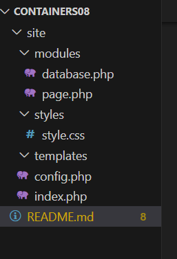

### Лабараторная работа №8
***
Тема: Непрерывная интеграция с помощью Github Actions
Выполнил: Алексеев Сергей
Дата: 09.04.25
***
### Цель работы
В рамках данной работы студенты научатся настраивать непрерывную интеграцию с помощью Github Actions.
***
### Задание
Создать Web приложение, написать тесты для него и настроить непрерывную интеграцию с помощью Github Actions на базе контейнеров.
***
### Ход работы

1) Создаем директорию site со следующей структурой:
    - 

2) 
